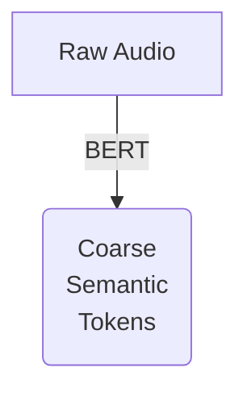
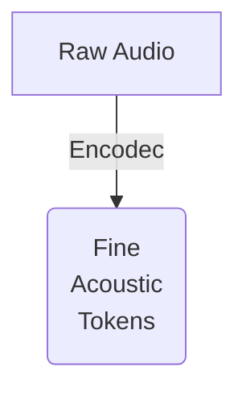

# Notes

This is a file that contains notes and explanations about the original paper.
This serves me (Jose') only as a reference and to make sure that we've got everything covered.

## Abstract

The main goal of AudioLM is to get audio with long-term consistency.
In the context of deep learning and audio processing, "long-term audio consistency" refers to the ability of a model to generate or process audio signals in a consistent manner over extended periods of time or across different segments of an audio stream.
This is particularly important in tasks such as speech recognition, music generation, or audio synthesis, where maintaining coherence and consistency in the generated audio is crucial for producing high-quality results.
What AudioLM does is maps the audio into a discrete space called tokens.
In doing so the audio is treated as a language modelling task.
A language modeling task involves predicting the next word (or token) in a sequence of text given the context of preceding words.
The goal is to build a statistical model that captures the structure and patterns of language, allowing the model to generate coherent and meaningful text.
In the end AudioLM learns to generate natual and coeherent audio continuations given short prompts (3 seconds according to the paper).

## Introduction

Audio in general, be it speech or music comprises a lot of levels of abstractions, which interacts with each other.
This makes the task of audio synthesis challenging.
AudioLM enables high-quality audio generation with long-term coherent structure by combining adversarial neural audio compression, self supervised learning and language modelling.

> The first thing that we do is construct coarse semantic tokens, through a from a model pre-trained with a self-supervised masked language modeling objective, this captures local and global long-term structures.

> Bert's tokens lead to poor reconstruction of the audio, to overcome this limitation, in addition to semantic tokens, acoustic tokens where produced using SoundStream (Encodec in our implementation).

What AudioLM proves is that acoustic tokens and semantic tokens sor of complement each other (more on this later).

## Related Works

### High-fidelty neural audio syntesis

AudioLM leverages tokens produced by a neural codec.
Unlike traditional approaches that use these tokens for lossy reconstruction, AudioLM treats them as targets for a sequence modeling task operating at a lower sampling rate.
This sequence modeling task can then be decoded back to audio at the original sampling rate, allowing for high-fidelity audio synthesis.

### Self-supervised learning of audio representations

Neural audio synthesis methods traditionally focus on modeling fine details of the audio signal, aiming to generate high-fidelity audio waveforms.
However, self-supervised learning approaches in the context of audio often target discovering high-level representations that capture semantic information about the audio content.

Self-supervised learning methods based on contrastive and predictive objectives tend to capture coarse, high-level information about the audio signal, making them useful for discriminative tasks like speech recognition or audio classification. However, they may not encode fine details of the original audio signal, limiting their direct usability for synthesis tasks.

The AudioLM approach addressed in the passage leverages these high-level representations obtained from self-supervised learning as a conditioning signal for audio synthesis. By using these representations to guide the prediction of high-quality acoustic tokens, AudioLM can generate synthesized audio that retains semantic information while also capturing fine details of the original signal, thus overcoming the limitations of other self-supervised learning approaches in audio synthesis.
[This however does not not come for free](#tradeoffs-of-discrete-audio-representations)

### Generating natural signals with language models

Neural language models, powered by techniques like self-attention, have shown impressive capabilities across various tasks including open-ended dialog modeling, code completion, and even mathematical problem-solving like integrals and differential equations, the key mechanism is self-attention.

Self-attention allows the model to capture rich and complex long-range dependencies within the input sequences.
However, the computational cost of standard self-attention grows quadratically with the length of input sequences, making it impractical for modeling very long sequences.

This scalability issue limits the direct application of self-attention-based models to tasks involving raw natural signals.
A solution is to map the natural signals to a compact, discrete representation space, where the representations can be modeled using autoregressive Transformers.

## Model

### Components

We consider a single channel audio sequence $x\in\mathbb{R}^T$,
which is processed by the following three components of the AudioLM
framework:

- **Tokenizer model** : this component takes as input the audio and maps into a sequence of discrete tokens. Such sequence is two to three orders of magnitue smaller than the original size ($T$, dimension of $x$).
- **Decoder only Transformer LM**: this component operates on discrete tokens reulting from the tokenizer model. At inference time predicts the next token based on the previos.
- **Detokenizer model**: this maps the sequence of predicted tokens back to audio.

### Tradeoffs of discrete audio representations

While we want to reconstruct audio waverforms ar high-quality, we also want to obtain a compact representation that captures long-term dependencies.
This are in fact conflicting requirements.
To reconcile them we need both semantic tokens and sintactic tokens.
The semantic tokens enable a compact representation with long term coherence, while the sintactic tokens enable high-audio quality.

### Hierarchical modeling of semantic and acoustic token

The AudioLM framework adopts a hierarchical approach to modeling, where semantic tokens are modeled first for the entire sequence, and then these semantic tokens are used as conditioning to predict the acoustic tokens.

- **Semantic modeling**: The first stage models the autoregressive prediction of semantic tokens to capture longterm temporal structure.
- **Coarse acoustic modeling**: In the second stage of the AudioLM framework, the focus is on predicting acoustic tokens from the coarse quantizers of the SoundStream model. The acoustic tokens are conditioned (?) on the semantic tokens obtained from the first stage of the framework. Due to residual quantization in the SoundStream model, the acoustic tokens exhibit a hierarchical structure. We rely
on the simple approach of flattening the acoustic tokens
in a row-major order to handle their hierarchical structure.
